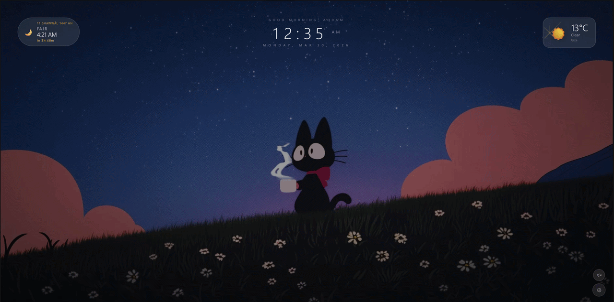
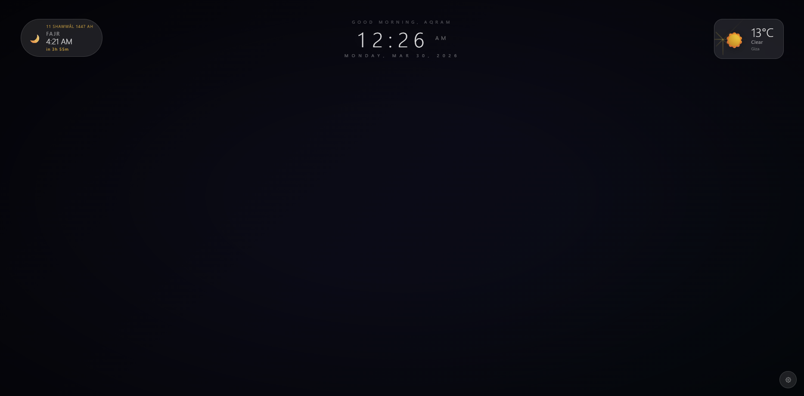
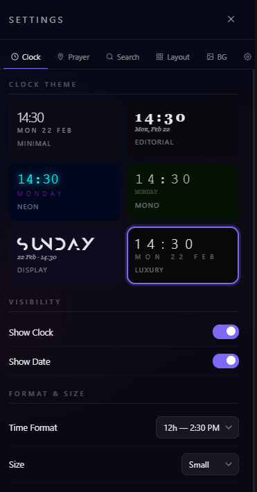
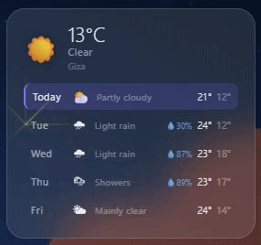
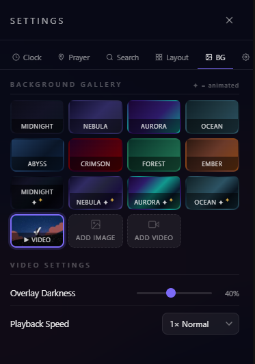

# UrTab

**A beautiful, New tab ！ prayer times, live weather, animated backgrounds, clock themes. Zero dependencies, no account required.**

 

 

 

---

## Features

### &#x1F54C; Prayer Times
- Real-time Salah times based on GPS location, powered by [Aladhan API](https://aladhan.com/prayer-times-api)
- Hijri date shown in every style
- Advances automatically as each prayer passes ！ no manual refresh
- **4 widget styles:** Minimal ， Bar ， Card ， Mosque
- **6 calculation methods:** Egyptian ， Umm Al-Qura ， ISNA ， MWL ， Karachi ， Diyanet
- Auto-refreshes at midnight

### &#x26C5; Weather
- Current conditions + **5-day forecast** via [Open-Meteo](https://open-meteo.com/) ！ free, no API key
- **4 styles:** Pill ， Card ， Minimal ， Forecast (with high/low temps and rain probability)
- Celsius or Fahrenheit
- Location cached cross-session ！ weather loads instantly on every new tab

### &#x1F3A8; Backgrounds
- **12 gradient presets** ！ 8 static, 4 animated (slow-shifting color loops)
- Upload your own **image** or **video** loop
  - Video stored via IndexedDB ！ 16 MB files load in under a second
  - Adjustable overlay darkness and playback speed
  - Mute/unmute

### &#x1F552; Clock
- **6 themes:** Minimal ， Editorial ， Neon ， Mono ， Display ， Luxury
- 12h / 24h format, 4 sizes
- Optional greeting: *Good Morning / Afternoon / Evening, Name*
- Display theme supports the Anurati typeface (optional font file)

### &#x1F50D; Search & Links
- 4 search styles, 4 engines (Google ， Bing ， DuckDuckGo ， Brave)
- 6 link styles, 3 icon sizes, fully editable shortcuts

### &#x2699; Layout & More
- Every widget has a **3〜3 position grid** ！ drag-free placement
- Auto-fade on inactivity (configurable delay)
- Animated favicon ！ live clock in the browser tab
- Settings toggle (open/close), keyboard shortcut: `Esc`

---

## Installation

> **No build step. No npm. Just unzip and load.**

1. Download source code from [Releases](../../releases)
2. Unzip it
3. Open Chrome &rarr; `chrome://extensions`
4. Enable **Developer mode** (top-right toggle)
5. Click **Load unpacked** &rarr; select the unzipped folder
6. Open a new tab

To update: replace the folder contents and click &#x21BB; on the extension card.

---

## Screenshots

| New Tab | Settings & Customization |
|:---:|:---:|
|  |  |
| *Clean, minimal interface* | *Deep customization options* |

| Weather Forecast | Background Presets |
|:---:|:---:|
|  |  |

---

## Permissions

| Permission | Why |
|---|---|
| `storage` | Saves settings, backgrounds, links, and cached location |
| `geolocation` | Required for prayer times and weather |

No tracking. No analytics. No ads. No external scripts.

---

## APIs Used

All completely free ！ no account or API key needed.

| API | Purpose |
|---|---|
| [Open-Meteo](https://open-meteo.com/) | Current weather + 7-day forecast |
| [BigDataCloud](https://www.bigdatacloud.com/) | City name from coordinates |
| [Aladhan](https://aladhan.com/prayer-times-api) | Prayer times + Hijri date |

---
## Changelog
### v2.0 ！ Complete rewrite
- Muslim prayer times widget with 4 styles and Hijri date
- 5-day weather forecast (same free API)
- 4 animated gradient backgrounds
- 6 clock themes including Display/Anurati
- Video backgrounds via IndexedDB (instant load, any size)
- Animated favicon (live clock in browser tab)
- Settings panel with 6 tabs, toggle open/close
- Geolocation persisted cross-session
- Page Visibility API ！ pauses when tab is hidden
- Zero dependencies

---

## License

MIT ！ do whatever you want, attribution appreciated.
